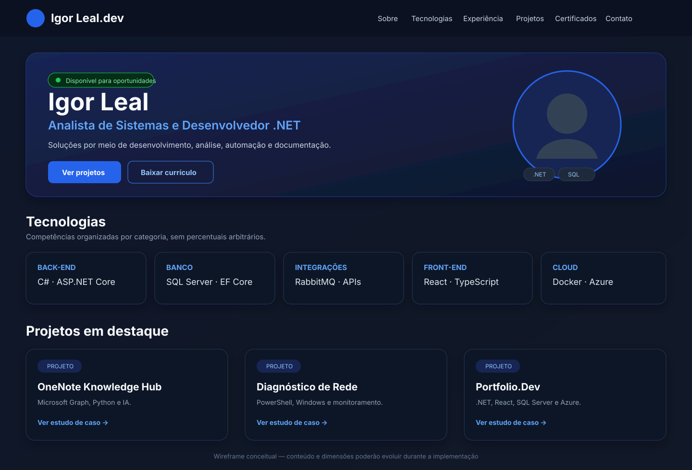
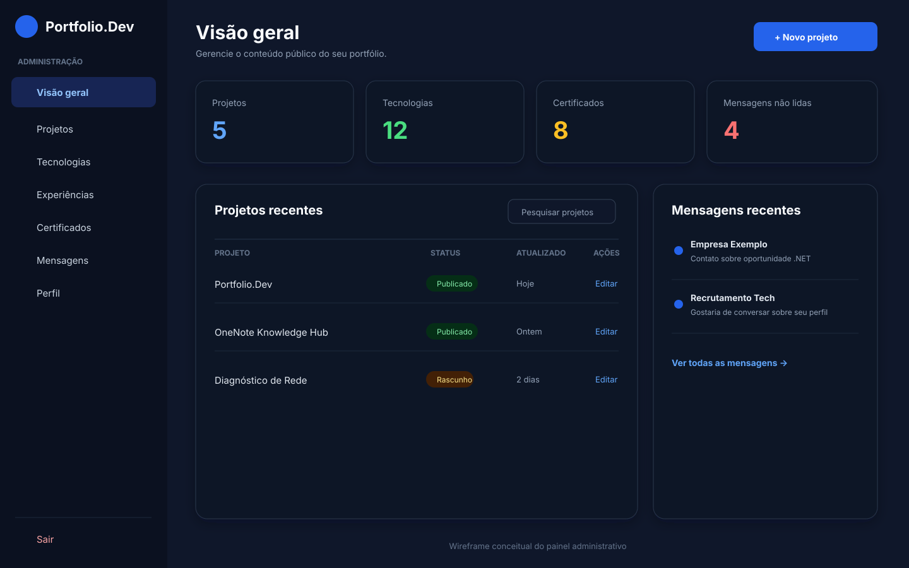
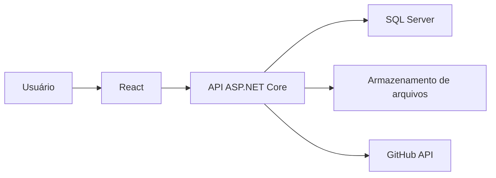
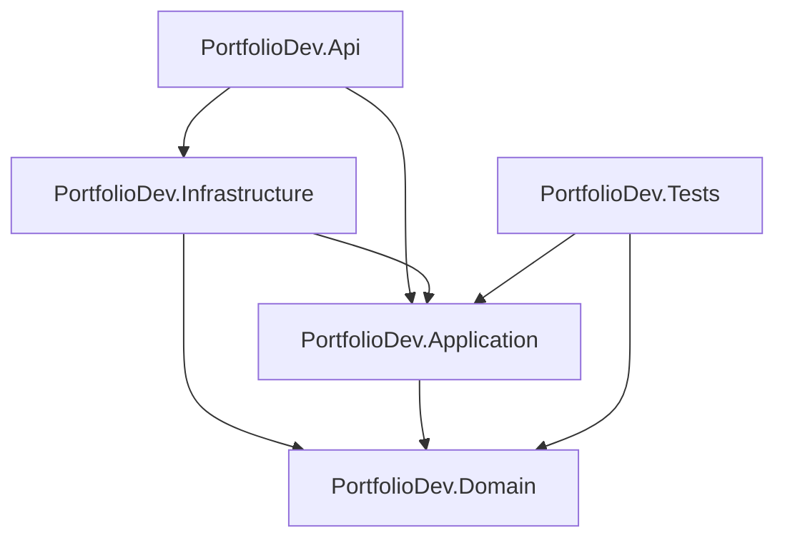

<div align="center">

# Portfolio.Dev

### Portfólio profissional full stack com ASP.NET Core, React e SQL Server

[](https://dotnet.microsoft.com/)
[](https://react.dev/)
[](https://www.typescriptlang.org/)
[](https://www.microsoft.com/sql-server/)
[](#status-do-projeto)

Projeto criado por **Igor Leal** para apresentar experiências, competências e projetos e, ao mesmo tempo, demonstrar na prática desenvolvimento back-end, APIs REST, banco de dados, front-end, testes, containers, cloud e CI/CD.

</div>

---

## Sobre o projeto

O **Portfolio.Dev** não será apenas uma página estática. A proposta é construir uma aplicação completa formada por:

- site público responsivo;
- API REST em ASP.NET Core;
- banco de dados SQL Server;
- painel administrativo autenticado;
- gerenciamento de projetos, tecnologias, experiências e certificados;
- formulário de contato;
- upload e armazenamento de imagens;
- testes automatizados;
- containers Docker;
- publicação na Azure;
- pipeline de integração e entrega contínuas.

O projeto também funciona como uma trilha prática de estudos. Cada etapa, decisão, comando, problema e validação é documentado no repositório.

## Objetivos

- apresentar a trajetória profissional de forma clara e moderna;
- transformar projetos reais em estudos de caso;
- aplicar arquitetura organizada em uma solução .NET;
- desenvolver e documentar uma API REST profissional;
- praticar SQL Server e Entity Framework Core;
- criar uma interface responsiva com React e TypeScript;
- implementar autenticação, validações, logs e tratamento de erros;
- automatizar testes, build e deploy;
- manter histórico técnico de toda a construção.

## Demonstração visual

### Página pública



### Painel administrativo



> Os mockups representam a direção visual inicial. O conteúdo e os componentes poderão evoluir durante a implementação.

## Arquitetura



### Organização do back-end



| Projeto | Responsabilidade |
|---|---|
| `PortfolioDev.Api` | Endpoints HTTP, configuração, autenticação e middlewares |
| `PortfolioDev.Application` | Casos de uso, DTOs, interfaces e validações |
| `PortfolioDev.Domain` | Entidades, regras centrais e contratos de domínio |
| `PortfolioDev.Infrastructure` | SQL Server, Entity Framework Core, repositórios e serviços externos |
| `PortfolioDev.Tests` | Testes automatizados |

O domínio permanece independente das tecnologias externas. A infraestrutura implementa os acessos necessários, enquanto a API expõe as funcionalidades via HTTP.

## Tecnologias

### Já utilizadas

- C#;
- .NET 10;
- ASP.NET Core Web API;
- xUnit;
- Git e GitHub;
- Visual Studio.

### Planejadas

- SQL Server 2025;
- Entity Framework Core;
- FluentValidation;
- autenticação JWT;
- React;
- TypeScript;
- Vite;
- Tailwind CSS;
- Postman;
- Docker e Docker Compose;
- Azure App Service;
- Azure SQL;
- Azure Blob Storage;
- Application Insights;
- GitHub Actions.

## Funcionalidades planejadas

### Site público

- [ ] apresentação profissional;
- [ ] seção Sobre mim;
- [ ] tecnologias por categoria;
- [ ] linha do tempo profissional;
- [ ] projetos em destaque;
- [ ] página detalhada para cada projeto;
- [ ] certificados;
- [ ] formulário de contato;
- [ ] download do currículo;
- [ ] links para GitHub e LinkedIn;
- [ ] tema escuro e responsividade.

### Painel administrativo

- [ ] autenticação do administrador;
- [ ] dashboard com indicadores;
- [ ] CRUD de projetos;
- [ ] CRUD de tecnologias;
- [ ] CRUD de experiências;
- [ ] CRUD de certificados;
- [ ] gerenciamento das mensagens recebidas;
- [ ] upload de imagens e documentos.

### Qualidade e operação

- [ ] validação das entradas;
- [ ] tratamento global de erros;
- [ ] logs estruturados;
- [ ] testes unitários;
- [ ] testes de integração;
- [ ] documentação OpenAPI;
- [ ] Health Checks;
- [ ] containers Docker;
- [ ] CI/CD;
- [ ] observabilidade na Azure.

## Estrutura do repositório

```text
PortfolioDev/
├── backend/
│   ├── PortfolioDev.Api/
│   ├── PortfolioDev.Application/
│   ├── PortfolioDev.Domain/
│   ├── PortfolioDev.Infrastructure/
│   └── PortfolioDev.Tests/
├── frontend/
├── docs/
│   ├── assets/
│   ├── CRONOGRAMA_ETAPAS.md
│   ├── DIARIO_DESENVOLVIMENTO.md
│   ├── GUIA_INSTALACAO_AMBIENTE.md
│   ├── PROTOTIPO_VISUAL.md
│   └── REFERENCIAS_VISUAIS.md
├── .gitignore
├── PortfolioDev.sln
└── README.md
```

## Como executar o estado atual

### Pré-requisitos

- .NET SDK 10;
- Visual Studio com a carga ASP.NET e desenvolvimento Web;
- Git.

O guia completo de preparação está em [`docs/GUIA_INSTALACAO_AMBIENTE.md`](docs/GUIA_INSTALACAO_AMBIENTE.md).

### 1. Clonar o repositório

```powershell
git clone https://github.com/IgorHLeal/PortfolioDev.git
```

```powershell
cd PortfolioDev
```

### 2. Restaurar as dependências

```powershell
dotnet restore
```

### 3. Compilar

```powershell
dotnet build
```

### 4. Executar os testes

```powershell
dotnet test
```

### 5. Executar a API

```powershell
dotnet run --project backend/PortfolioDev.Api/PortfolioDev.Api.csproj
```

O endereço HTTPS exato será exibido no terminal. A API ainda contém somente a estrutura inicial gerada pelo template.

## Banco de dados

A modelagem e a integração com o SQL Server serão implementadas nas próximas etapas.

No desenvolvimento local, a aplicação e o SQL Server estarão no mesmo computador. Portanto, não é necessário abrir a porta 1433 no Firewall do Windows. O procedimento para cenários de acesso remoto está documentado no guia de instalação.

## Documentação

| Documento | Conteúdo |
|---|---|
| [`CRONOGRAMA_ETAPAS.md`](docs/CRONOGRAMA_ETAPAS.md) | Cronograma, status e verificação objetiva das etapas |
| [`GUIA_INSTALACAO_AMBIENTE.md`](docs/GUIA_INSTALACAO_AMBIENTE.md) | Instalação e validação das ferramentas |
| [`DIARIO_DESENVOLVIMENTO.md`](docs/DIARIO_DESENVOLVIMENTO.md) | Histórico de etapas, comandos, decisões e erros |
| [`PROTOTIPO_VISUAL.md`](docs/PROTOTIPO_VISUAL.md) | Especificação das telas e componentes |
| [`REFERENCIAS_VISUAIS.md`](docs/REFERENCIAS_VISUAIS.md) | Mockups, arquitetura e fluxogramas |

## Status do projeto

O projeto está **em desenvolvimento**.

### Concluído

- definição do objetivo e escopo;
- definição da arquitetura inicial;
- preparação do ambiente;
- criação do repositório;
- criação da solução .NET;
- criação e relacionamento dos cinco projetos do back-end;
- primeiro build;
- primeiros testes;
- documentação inicial;
- protótipo conceitual.

### Próximo marco

Modelagem do banco de dados e criação das entidades de domínio.

## Roadmap resumido

| Fase | Entrega | Situação |
|---|---|---|
| Planejamento | Escopo, arquitetura e protótipo | Em validação |
| Fundação .NET | Solution e projetos | Concluída |
| Domínio e banco | Entidades, EF Core e migrations | Pendente |
| API | Endpoints, validações e documentação | Pendente |
| Segurança | Login e JWT | Pendente |
| Front-end | Site público em React | Pendente |
| Administração | Dashboard e CRUDs | Pendente |
| Qualidade | Testes e revisão | Pendente |
| Containers | Docker e Compose | Pendente |
| Cloud | Azure e observabilidade | Pendente |
| DevOps | GitHub Actions e deploy contínuo | Pendente |

## Padrão de commits

O projeto utiliza mensagens objetivas, inspiradas em Conventional Commits:

```text
feat: adiciona uma funcionalidade
fix: corrige um comportamento
docs: altera a documentação
test: adiciona ou modifica testes
refactor: reorganiza o código sem mudar o comportamento
chore: executa uma tarefa de manutenção
```

Exemplo:

```powershell
git commit -m "docs: cria readme principal do projeto"
```

## Segurança

Não devem ser enviados ao repositório:

- senhas;
- tokens;
- chaves de API;
- strings de conexão reais;
- arquivos `.env` com valores locais;
- segredos da Azure;
- certificados privados.

Os segredos serão tratados posteriormente com variáveis de ambiente, User Secrets e configurações seguras da Azure.

## Autor

**Igor Leal**

- GitHub: [@IgorHLeal](https://github.com/IgorHLeal)
- LinkedIn: adicionar URL definitiva

## Licença

A licença do projeto será definida antes da primeira versão pública de produção.
