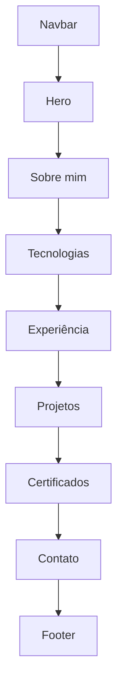

# Portfolio.Dev — Protótipo visual

## 1. Objetivo

Definir a experiência visual da página pública e do painel administrativo antes da implementação em React. O protótipo servirá como referência para componentes, banco de dados, endpoints e responsividade.

## 2. Direção visual

O Portfolio.Dev terá uma aparência profissional, minimalista e tecnológica, sem excesso de efeitos.

| Elemento | Definição inicial |
|---|---|
| Tema principal | Escuro |
| Cor de destaque | Azul `#2563EB` |
| Fundo principal | Azul muito escuro `#0F172A` |
| Fundo dos cards | `#111827` |
| Texto principal | `#F8FAFC` |
| Texto secundário | `#94A3B8` |
| Sucesso/disponibilidade | Verde `#22C55E` |
| Fonte | Inter, com fallback para sans-serif |
| Cantos | Arredondamento discreto entre 8 e 16 px |
| Sombras | Leves, usadas apenas para separar níveis |
| Animações | Curtas e funcionais, respeitando redução de movimento |

## 3. Princípios de interface

- leitura rápida por recrutadores;
- conteúdo principal acessível sem login;
- contraste adequado entre fundo e texto;
- navegação por teclado;
- responsividade desde o início;
- animações sem atrapalhar a leitura;
- informações reais, sem barras de habilidade com percentuais arbitrários;
- botões com rótulos claros;
- carregamento rápido e imagens otimizadas.

## 4. Página pública

### Ordem das seções



### 4.1 Navbar

**Lado esquerdo:** marca textual `Igor Leal.dev`.

**Lado direito:**

- Sobre;
- Tecnologias;
- Experiência;
- Projetos;
- Certificados;
- Contato;
- botão de alternância de tema.

No celular, os links serão agrupados em um menu expansível. A navegação ficará fixa no topo com fundo levemente translúcido.

### 4.2 Hero

#### Coluna de conteúdo

- selo `Disponível para oportunidades`;
- nome `Igor Leal`;
- título profissional;
- resumo de duas ou três linhas;
- tecnologias principais;
- botões `Ver projetos` e `Baixar currículo`;
- ícones com links para GitHub e LinkedIn.

#### Coluna visual

Inicialmente será usado um card profissional com fotografia ou avatar e pequenos destaques técnicos. A imagem definitiva será definida antes da publicação.

#### Texto inicial

```text
Igor Leal

Analista de Sistemas e Desenvolvedor .NET

Transformo problemas técnicos e necessidades de negócio em soluções por meio de desenvolvimento, análise, automação e documentação.
```

### 4.3 Sobre mim

Layout em duas colunas no desktop e uma coluna no celular:

- texto profissional;
- números de destaque, como tempo de experiência e tecnologias utilizadas;
- foco atual em desenvolvimento back-end .NET e suporte de aplicações.

O texto não deverá apresentar a experiência como apenas uma transição. Ele deve valorizar a experiência real com suporte, análise de sistemas, C#, SQL Server, APIs, deploys e liderança técnica.

### 4.4 Tecnologias

Cards agrupados por categoria:

| Categoria | Exemplos |
|---|---|
| Back-end | C#, .NET, ASP.NET Core, APIs REST |
| Banco de dados | SQL Server, Entity Framework Core |
| Integrações | RabbitMQ, Postman |
| Front-end | React, TypeScript, HTML, CSS |
| DevOps e cloud | Git, GitHub Actions, Docker, Azure |
| Infraestrutura | Windows Server, IIS e redes |

Cada card mostrará ícone, nome e categoria. Não serão utilizados percentuais de domínio.

### 4.5 Experiência

Linha do tempo vertical contendo:

- cargo;
- empresa;
- período;
- resumo das atividades;
- tecnologias e competências relacionadas.

No celular, todos os itens permanecerão em uma única coluna.

### 4.6 Projetos

Grade com dois ou três cards por linha, dependendo da largura disponível.

Cada projeto conterá:

- imagem de capa;
- título;
- resumo;
- tecnologias;
- status;
- link do GitHub;
- link de demonstração, quando existir;
- botão `Ver detalhes`.

Projetos iniciais:

1. OneNote Knowledge Hub;
2. Diagnóstico de Rede Windows;
3. API Troubleshooter;
4. KB Assistant;
5. Portfolio.Dev.

### 4.7 Certificados

Cards compactos com:

- nome do curso ou certificado;
- instituição;
- data de conclusão;
- carga horária, quando aplicável;
- link de validação ou visualização.

### 4.8 Contato

O formulário terá:

- nome;
- e-mail;
- empresa opcional;
- assunto;
- mensagem;
- consentimento para envio;
- botão `Enviar mensagem`.

Serão exibidos estados visuais de carregamento, sucesso, validação e erro.

### 4.9 Footer

- nome e ano atual;
- links do GitHub e LinkedIn;
- navegação rápida;
- indicação das principais tecnologias usadas na construção do site.

## 5. Página de detalhes do projeto

Cada projeto poderá ter uma página própria com:

- título e resumo;
- problema solucionado;
- contexto;
- tecnologias;
- arquitetura;
- funcionalidades;
- desafios encontrados;
- decisões técnicas;
- imagens;
- links de código e demonstração.

Essa página transforma cada projeto em um estudo de caso, oferecendo mais valor ao recrutador que apenas um card.

## 6. Painel administrativo

### Navegação

Menu lateral no desktop e menu recolhível no celular:

- Visão geral;
- Projetos;
- Tecnologias;
- Experiências;
- Certificados;
- Mensagens;
- Perfil;
- Sair.

### Dashboard

Cards de resumo:

- quantidade de projetos;
- quantidade de tecnologias;
- quantidade de certificados;
- mensagens não lidas.

Também haverá uma lista das mensagens recentes e atalhos para cadastrar conteúdo.

### Telas CRUD

As telas administrativas terão:

- título da área;
- botão de cadastro;
- pesquisa;
- filtros;
- tabela ou lista;
- paginação;
- ações de visualizar, editar e excluir;
- confirmação antes de exclusões.

### Login

Tela centralizada com:

- marca do projeto;
- e-mail;
- senha;
- mostrar/ocultar senha;
- mensagem de credenciais inválidas;
- estado de carregamento.

O painel não terá link público na navegação principal.

## 7. Responsividade

| Faixa | Comportamento |
|---|---|
| Até 639 px | Uma coluna, menu móvel e botões em largura adequada |
| 640 a 1023 px | Uma ou duas colunas conforme o conteúdo |
| 1024 px ou mais | Layout completo, grade de projetos e menu horizontal |

O protótipo será testado, no mínimo, nas larguras de 375 px, 768 px, 1024 px e 1440 px.

## 8. Componentes previstos no React

```text
Navbar
MobileMenu
Hero
SectionTitle
TechnologyCard
ExperienceTimeline
ProjectCard
CertificateCard
ContactForm
Footer
ThemeToggle
LoadingState
EmptyState
ErrorState
```

Componentes administrativos:

```text
AdminLayout
Sidebar
DashboardCard
DataTable
SearchField
FilterBar
Pagination
FormField
ConfirmDialog
Toast
```

## 9. Estados que precisam ser desenhados

Não basta desenhar apenas a tela preenchida. A implementação deverá considerar:

- carregando;
- lista vazia;
- erro de comunicação com a API;
- validação de formulário;
- envio concluído;
- sessão expirada;
- página não encontrada;
- confirmação de exclusão.

## 10. Acessibilidade

- contraste mínimo adequado;
- foco visível nos controles;
- textos alternativos nas imagens;
- rótulos associados aos campos;
- mensagens de erro compreensíveis;
- elementos interativos utilizáveis por teclado;
- estrutura semântica de títulos;
- suporte à preferência `prefers-reduced-motion`.

## 11. Critérios de aprovação do protótipo

- [ ] A ordem das seções está aprovada.
- [ ] O título profissional está aprovado.
- [ ] A paleta está aprovada.
- [ ] A escolha entre fotografia e avatar está definida.
- [ ] Os projetos iniciais estão corretos.
- [ ] Os campos do formulário estão corretos.
- [ ] A estrutura do painel administrativo está aprovada.
- [ ] As versões desktop e mobile estão previstas.
- [ ] Os estados de carregamento, erro e vazio estão previstos.

## 12. Resultado esperado

Ao aprovar este documento, teremos informação suficiente para modelar as entidades, os relacionamentos do banco, os contratos da API e os componentes do React sem depender de decisões improvisadas durante a codificação.

