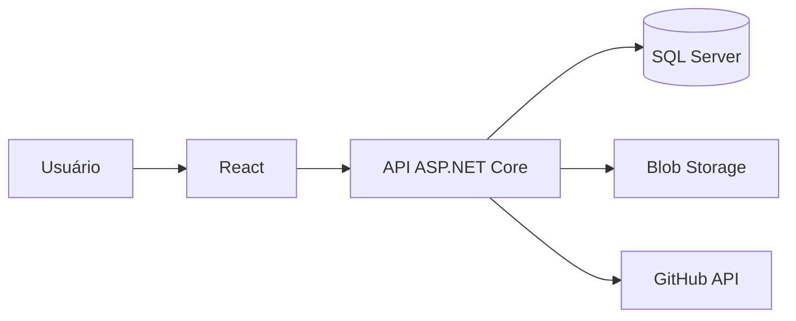
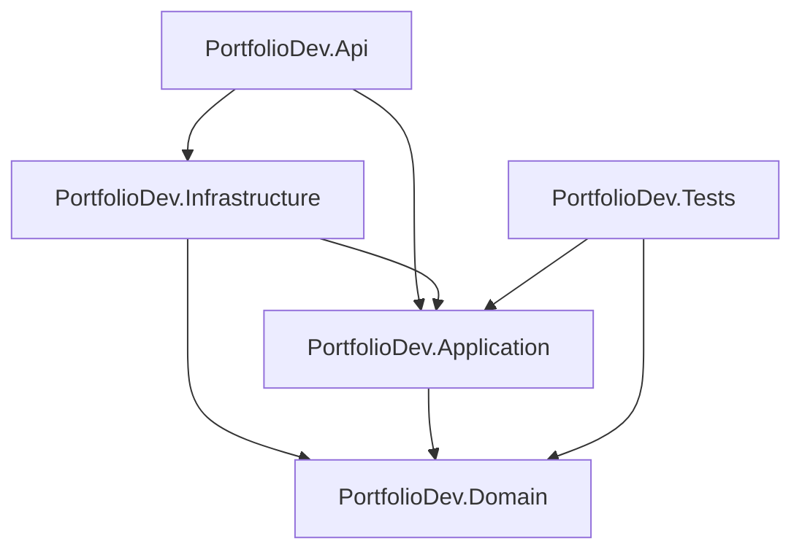
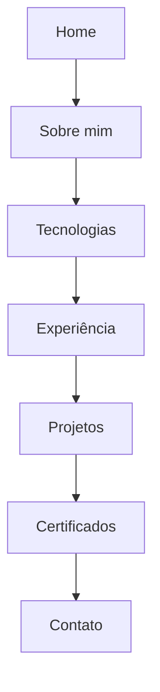
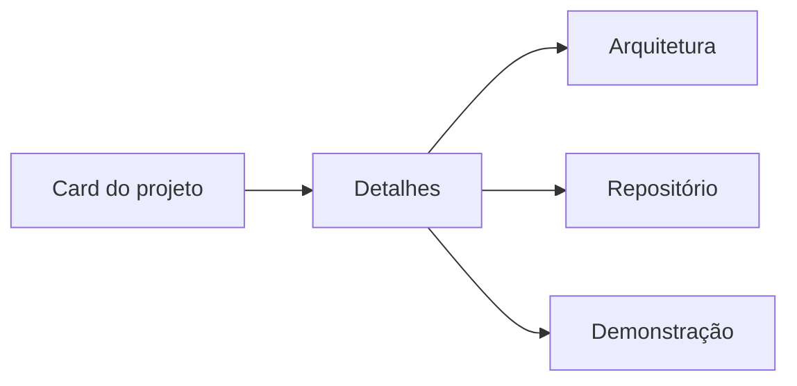
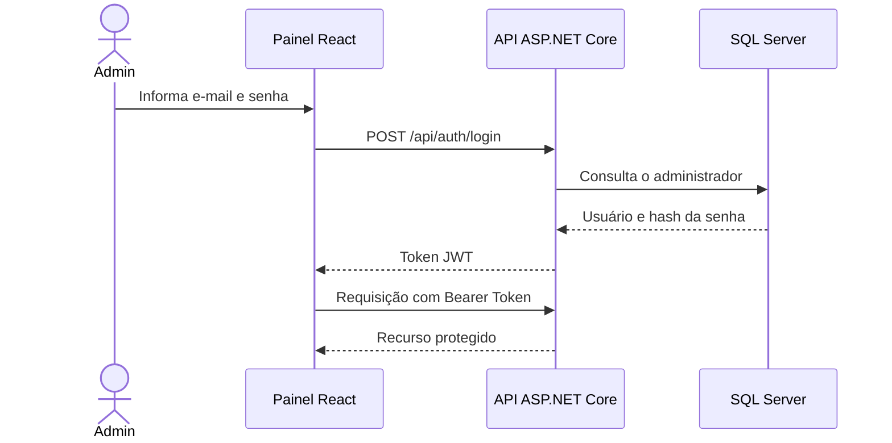
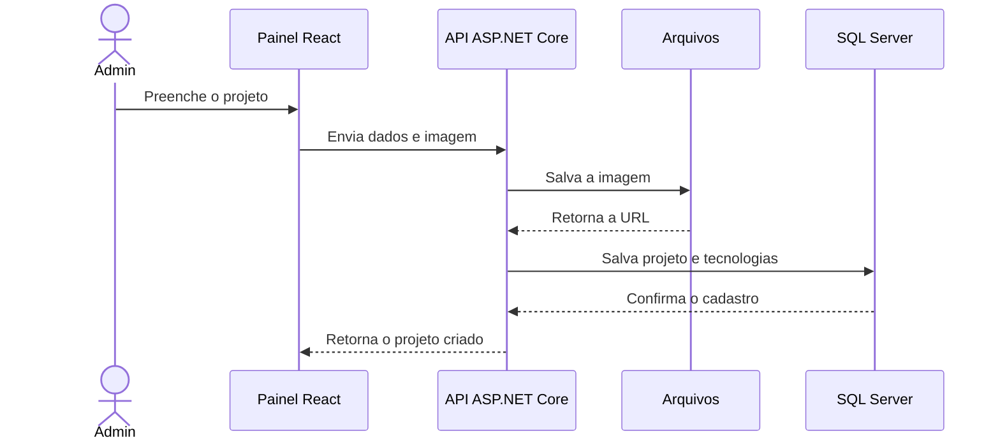
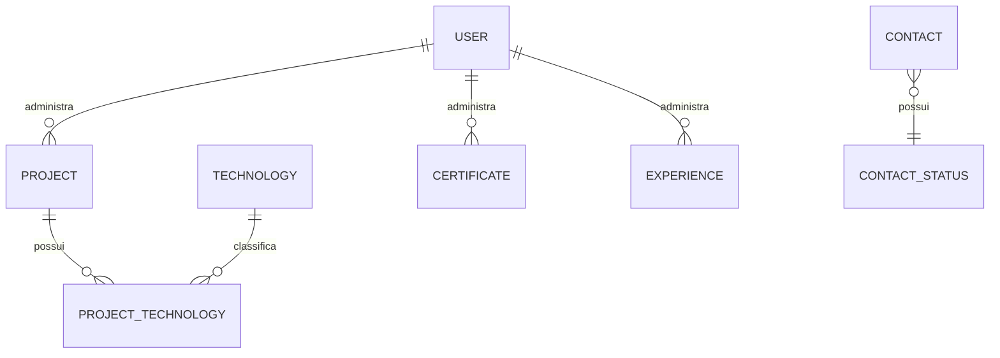
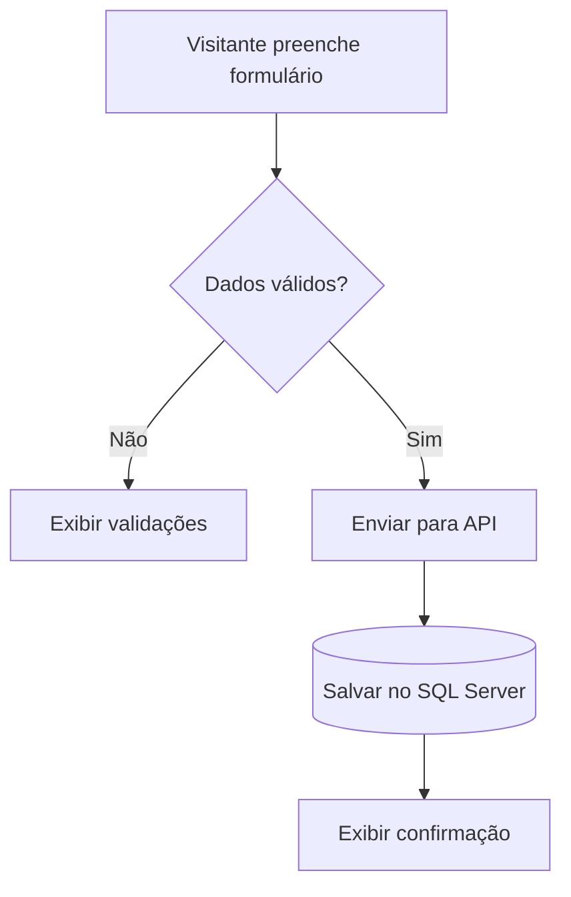
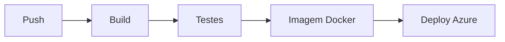
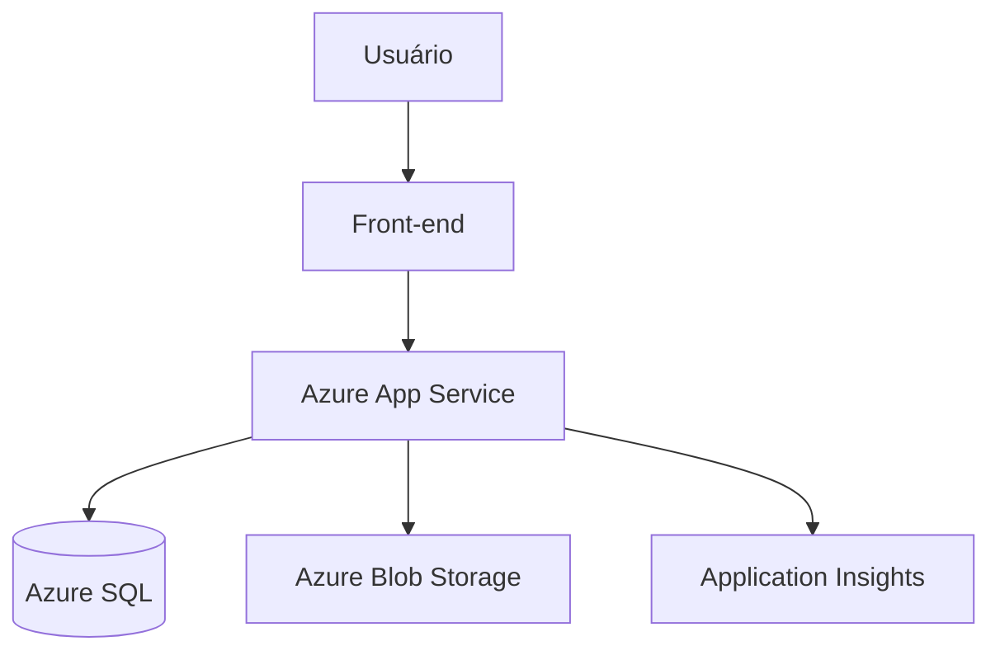

# Portfolio.Dev — Referências visuais e fluxogramas

Este documento reúne os exemplos visuais inicialmente propostos para o Portfolio.Dev. Os mockups são conceituais e deverão orientar a implementação, não impor medidas rígidas aos componentes.

## 1. Página pública


### Elementos demonstrados

- navegação superior;
- Hero com posicionamento profissional e chamadas para ação;
- espaço reservado para fotografia ou avatar;
- cards de tecnologias por categoria;
- projetos apresentados como estudos de caso;
- tema escuro e destaque azul.

## 2. Painel administrativo


### Elementos demonstrados

- menu lateral;
- indicadores principais;
- atalhos de cadastro;
- tabela de projetos;
- status de publicação;
- mensagens recentes;
- estrutura preparada para os CRUDs.

## 3. Arquitetura geral



## 4. Organização do back-end



### Regra de dependência

O domínio fica no centro e não depende das outras camadas. A infraestrutura implementa os acessos externos definidos pela aplicação, enquanto a API recebe e devolve requisições HTTP.

## 5. Fluxo público de navegação



Ao selecionar um projeto:



## 6. Fluxo de autenticação JWT



O diagrama representa o fluxo conceitual. Senhas nunca serão armazenadas em texto puro.

## 7. Fluxo de cadastro de projeto



## 8. Modelo relacional preliminar

Este modelo será detalhado na Etapa 10.



## 9. Fluxo de contato



## 10. Pipeline de CI/CD



Em caso de falha no build ou nos testes, a publicação será interrompida.

## 11. Arquitetura de produção no Azure



Os serviços definitivos e seus planos serão escolhidos durante a fase de cloud para evitar custos desnecessários.

## 12. Estados visuais obrigatórios

| Estado | Representação esperada |
|---|---|
| Carregando | Skeleton ou indicador discreto |
| Lista vazia | Mensagem explicativa e ação sugerida |
| Erro | Mensagem clara e opção de tentar novamente |
| Sucesso | Confirmação breve sem interromper a navegação |
| Sessão expirada | Redirecionamento para login com aviso |
| Exclusão | Caixa de confirmação com nome do item |

## 13. Uso dos arquivos

Estrutura esperada:

```text
docs/
├── REFERENCIAS_VISUAIS.md
└── assets/
    ├── mockup-painel-admin.svg
    └── mockup-site-publico.svg
```

Ao abrir `REFERENCIAS_VISUAIS.md` no GitHub, os SVGs e os diagramas Mermaid serão renderizados automaticamente.

